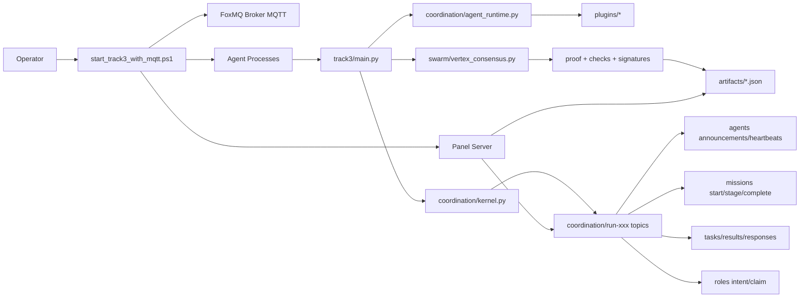
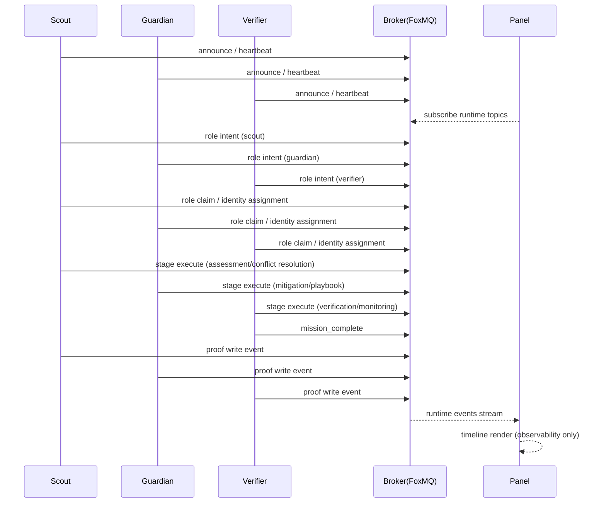

# Vertex Swarm Lab

## A Verifiable, Leaderless Multi-Agent Coordination System

Vertex Swarm Lab is a decentralized coordination runtime for security monitoring workflows.  
It uses FoxMQ (MQTT) for transport and Vertex DAG proofing for auditable, tamper-evident execution.

## Why This Project

- Fully decentralized multi-agent coordination without a central orchestrator
- Deterministic role negotiation across Scout / Guardian / Verifier
- Verifiable execution with signatures, proof checks, and mission artifacts
- Resilience validation with delay/drop fault scenarios
- Demo-ready panel for runtime visibility and business triggering

## Diagram 1: System Module Interaction (Static Architecture)



## Diagram 2: Business Sequence (Dynamic Flow)



## Repository Map (Scanned)

- `security_monitor/track3/`: runtime entrypoint and protocol orchestration
- `security_monitor/coordination/`: coordination kernel, task lifecycle, plugin runtime
- `security_monitor/transports/`: transport abstraction and FoxMQ MQTT transport
- `security_monitor/integration/`: FoxMQ adapter, AI engine, settlement integration
- `security_monitor/plugins/`: business plugins (`risk_control`, `threat_intel`, `verification`, `cross_org_alert`)
- `security_monitor/swarm/`: Vertex consensus, security/signing, fault injection, message model
- `security_monitor/scenarios/`: business templates and registries
- `security_monitor/roles/`: role-oriented agent implementations
- `security_monitor/panel/`: runtime panel API + rendering
- `security_monitor/tests/`: unit, integration, consensus, panel, and E2E tests
- `start_foxmq.ps1`: broker bootstrap
- `start_track3_with_mqtt.ps1`: one-command run/test entry

## Currently Supported Business Types

| Business Type         | Template File                      | Description                                           |
| :-------------------- | :--------------------------------- | :---------------------------------------------------- |
| `risk_control`        | `risk_control.default.json`        | Risk assessment and mitigation workflow               |
| `threat_intel`        | `threat_intel.default.json`        | Threat intelligence analysis and closed-loop response |
| `agent_marketplace`   | `agent_marketplace.default.json`   | Marketplace-style multi-agent coordination            |
| `distributed_rag`     | `distributed_rag.default.json`     | Distributed retrieval-augmented coordination flow     |
| `compute_marketplace` | `compute_marketplace.default.json` | Compute scheduling and task coordination              |

Default business type: `risk_control`.

## Threat Intel Business Semantics

| Stage | Role     | Action                                       | Output                                |
| :---- | :------- | :------------------------------------------- | :------------------------------------ |
| S0    | Scout    | Intake and context build                     | Mission start payload                 |
| S1    | Scout    | Source scoring and conflict resolution       | Confidence + resolved claim           |
| S2    | Scout    | ATT&CK / kill-chain mapping                  | Tactics, techniques, kill-chain stage |
| S3    | Guardian | Playbook planning and execution              | Action logs + rollback decision       |
| S4    | Verifier | Monitoring window and secondary verification | Residual risk + monitoring decision   |
| S5    | Verifier | Final closure or rollback confirmation       | Mission complete + proof checks       |

## Single-Machine Cluster Demo Quick Start

### 1) Start local FoxMQ

```powershell
powershell -ExecutionPolicy Bypass -File .\start_foxmq.ps1
```

Default endpoints:

- MQTT: `127.0.0.1:1883`
- Cluster: `127.0.0.1:19793`

### 2) Start local multi-agent cluster + panel

```powershell
powershell -ExecutionPolicy Bypass -File .\start_track3_with_mqtt.ps1 -Mode runtime-cluster -RuntimeClusterAgents 5 -PanelPort 8787 -RunId runtime5agents46
```

Panel URL (observability/demo only):

- `http://127.0.0.1:8787/`

### 3) Other demo modes

```powershell
# Bootstrap mission
powershell -ExecutionPolicy Bypass -File .\start_track3_with_mqtt.ps1 -Mode agent-bootstrap

# Internal acceptance
powershell -ExecutionPolicy Bypass -File .\start_track3_with_mqtt.ps1 -Mode internal-acceptance
```

## Public-Network Deployment Quick Start (Production-Oriented)

Goal: run distributed agents on different machines against the same public MQTT broker.

Current validation status:

- Validated: local multi-process cluster and LAN-style coordination flow.
- Not yet formally validated: public-network cross-region stability and long-run stress tests.
- So this section is a deployment guide/evolution path, not a claimed acceptance result.

### 1) Prepare a public MQTT broker

- Expose a reachable MQTT endpoint, for example: `<public-host>:1883`
- Open required network/security-group ports
- Verify connectivity from all agent nodes

### 2) Start agent process on each machine

```powershell
python -m security_monitor.track3.main --mode agent-process --agent-id <agent-id> --agent-capabilities scout,guardian,verifier --foxmq-backend mqtt --foxmq-mqtt-addr <public-host>:1883 --run-id <same-run-id> --topic-namespace run-<same-run-id>
```

Example (same swarm session):

- Machine A: `agent-a`
- Machine B: `agent-b1`, `agent-b2`

All agents within the same session should use the same `run_id` and `topic_namespace` so they join the same coordination space and can discover each other.
`agent-a / agent-b1 / agent-b2` are only sample IDs, not fixed requirements.

### 3) Optional: start panel as observer

```powershell
python -m security_monitor.panel.server --host 0.0.0.0 --port 8787 --artifacts-dir artifacts --run-id <same-run-id> --topic-namespace run-<same-run-id> --foxmq-mqtt-addr <public-host>:1883
```

Note: the panel is an observability layer, not a core production capability.

### 4) Why require the same run_id/topic_namespace?

- This is a session-isolation strategy to prevent traffic mixing across experiments and preserve auditability.
- In public-network evolution, a lobby/registry layer can be added for automatic session assignment.
- So this does not conflict with large-scale heterogeneous swarm discovery goals; it is a controlled engineering stage.

## Artifacts and Success Signals

Typical outputs:

- `artifacts/.../multiprocess_mission_record.json`
- `artifacts/.../coordination_proof.json`
- `artifacts/.../structured_event_log.json`
- `artifacts/.../acceptance_report.json`

Key fields:

- `all_success`
- `role_identity_assignments`
- `business_flow_log`
- `coordination_proof`
- `proof_checks`
- `standard_metrics`

## Quality Gates

```powershell
python -m ruff check .
python -m mypy security_monitor
python -m unittest security_monitor.tests.test_swarm_track3 -v
python -m unittest security_monitor.tests.test_vertex_consensus -v
```

## LAN Notes

- All machines must use the same MQTT endpoint
- All agents must share the same `run_id` and `topic_namespace`
- Use at least 3 agents for stable role coverage and convergence
