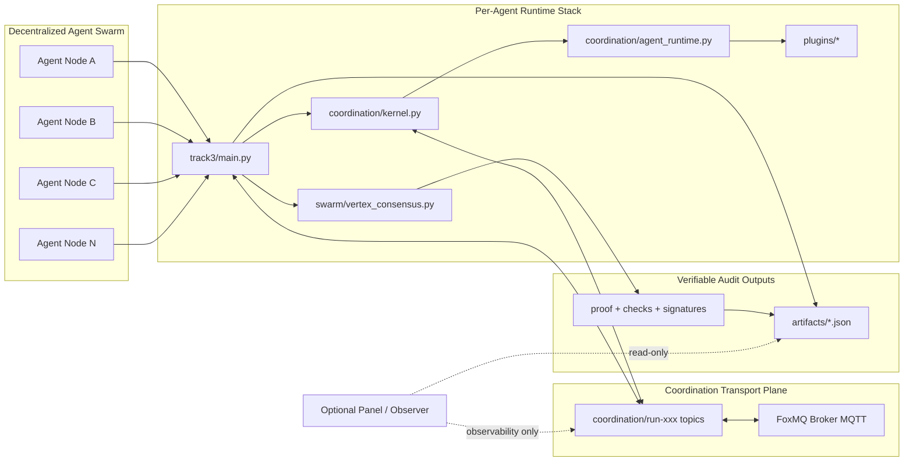
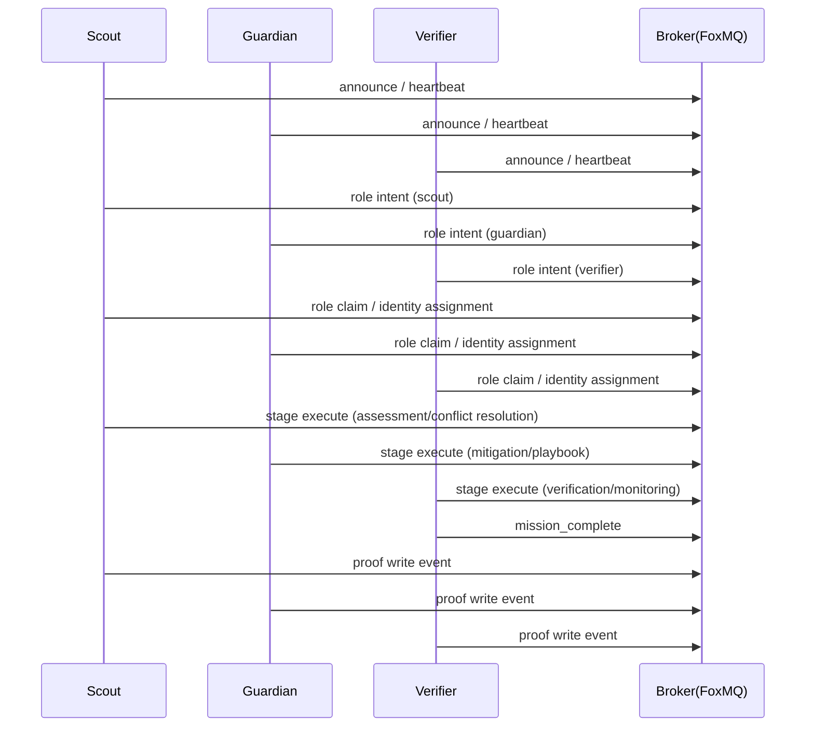

# Vertex Swarm Lab

## A Verifiable, Leaderless Multi-Agent Coordination System

Vertex Swarm Lab is a decentralized coordination runtime for security monitoring workflows.  
It uses FoxMQ (MQTT) for transport and Vertex DAG proofing for auditable, tamper-evident execution.

## TL;DR

- Leaderless multi-agent coordination over FoxMQ MQTT.
- Verifiable mission execution with proof and structured audit artifacts.
- Resilient operation validated under normal, delay, and drop scenarios.

## Competition Alignment

- Coordination Correctness: single winner, no double assignment, deterministic resolution under contention.
- Resilience: mission remains convergent under delay/drop and agent recovery scenarios.
- Auditability: Proof of Coordination is independently verifiable and tamper checks fail as expected on manipulated proofs.
- Security Posture: signed envelopes plus replay protection (nonce/timestamp window) validated in MQTT E2E tests.

## Result Snapshot (MQTT E2E)

- Strict cluster test discovery passed in MQTT mode.
- Competition alignment checks passed: Coordination Correctness / Resilience / Auditability / Security Posture.
- Core artifacts generated: `multiprocess_mission_record.json`, `coordination_proof.json`, `structured_event_log.json`, `economy_rounds.json`.

## Why This Project

- Fully decentralized multi-agent coordination without a central orchestrator
- Deterministic role negotiation across Scout / Guardian / Verifier
- Verifiable execution with signatures, proof checks, and mission artifacts
- Resilience validation with delay/drop fault scenarios
- Optional observability layer for demo and debugging only

## Operational Focus

- Core objective: business-stage closure with auditable evidence (`mission_record + proof + event_log`) under leaderless coordination.
- Execution model: role-governed pipeline (`Scout → Guardian → Verifier`) with domain semantics (`risk_control` / `threat_intel`).
- Decision transparency is built into assignment outputs so operator-side reviews can trace why each role winner was selected.

## Diagram 1: System Module Interaction (Static Architecture)



## Diagram 2: Business Sequence (Dynamic Flow)



### Decision Traceability

- Role claims include `economy_score_breakdown` so each assignment has score-level explainability.
- Winner records include `selection_reason` to make deterministic role selection auditable.
- Per-intent snapshots are persisted in `economy_rounds` with candidate data and budget/units rejection counters.
- Mission-level aggregation is persisted in `economy_summary` and exported via `artifacts/.../economy_rounds.json`.

### Role Responsibility and Capability Mapping (Risk Control)

| Role     | Primary responsibility                   | Input                                              | Output evidence                                             |
| :------- | :--------------------------------------- | :------------------------------------------------- | :---------------------------------------------------------- |
| Scout    | Identify and assess risk signals         | mission payload / business context                 | stage result, candidate score, selection reason             |
| Guardian | Execute mitigation and control actions   | scout output / mitigation constraints              | mitigation decision, rollback markers, signed stage payload |
| Verifier | Verify closure and residual risk         | guardian result / monitoring window                | verification decision, mission completion status            |
| Auditor  | Synthesize final evidence at CLOSE stage | mission record / proof checks / economy settlement | `auditor_evidence`, signed CLOSE-stage evidence payload     |

Capability mapping:

| Focus area                | Implementation in this project                                                                                                                          | Evidence artifact                                                                                                          |
| :------------------------ | :------------------------------------------------------------------------------------------------------------------------------------------------------ | :------------------------------------------------------------------------------------------------------------------------- |
| Multi-role protocol       | Native Scout/Guardian/Verifier execution roles + Auditor evidence role with protocol phases `DISCOVER -> ASSESS -> PLAN -> MITIGATE -> VERIFY -> CLOSE` | `multiprocess_mission_record.json` (`protocol_roles`, `protocol_phases`, `steps`, `auditor_evidence`, `business_flow_log`) |
| Deterministic convergence | Vertex ordered events with deterministic replay state hashing                                                                                           | `multiprocess_mission_record.json` (`ordered_event_index`, `state_hash_before`, `state_hash_after`, `convergence_check`)   |
| Economy settlement        | `RISK_CREDIT` escrow + split (Scout 35 / Guardian 40 / Verifier 20 / Burn-Reserve 5)                                                                    | `economy_rounds.json` (`unit`, `split_policy`, `settlement`)                                                               |
| Self-healing evidence     | Recovery event chain (`heartbeat_miss`, `quorum_confirmed_dead`, `role_redistributed`, `agent_rejoined`)                                                | `self_healing_events.json` and `multiprocess_mission_record.json` (`self_healing_events`)                                  |

Deterministic convergence statement:

- Same ordered event stream => same final state hash (`deterministic_replay_match=true`).
- Runtime execution roles are `Scout / Guardian / Verifier`; `Auditor` serves as the evidence-synthesizer role at `CLOSE` stage.
- For resilience evidence drill, use `--self-healing-drill` to emit a complete `SUSPECT -> DEAD -> REDISTRIBUTE -> REJOINING -> ACTIVE` chain in artifacts.

```powershell
python -m security_monitor.track3.main --run-id track3-drill --transport mqtt --mqtt-addr 127.0.0.1:1883 --mode internal-single --self-healing-drill
```

Expected artifacts after the drill run:

- `artifacts/track3-drill/multiprocess_mission_record.json`
- `artifacts/track3-drill/economy_rounds.json`
- `artifacts/track3-drill/self_healing_events.json`

## Core Modules

- `security_monitor/track3/`: runtime entrypoint and protocol orchestration.
- `security_monitor/coordination/`: kernel, task lifecycle, plugin runtime, role negotiation.
- `security_monitor/swarm/`: Vertex consensus, signing/security, fault injection, message model.
- `security_monitor/plugins/`: business plugins (`risk_control`, `threat_intel`, `verification`, `cross_org_alert`).
- `security_monitor/panel/`: observability API and visualization for demo/debug.
- `security_monitor/tests/`: unit, integration, consensus, panel, and E2E coverage.

## Currently Supported Business Types

| Business Type         | Template File                      | Description                                           |
| :-------------------- | :--------------------------------- | :---------------------------------------------------- |
| `risk_control`        | `risk_control.default.json`        | Risk assessment and mitigation workflow               |
| `threat_intel`        | `threat_intel.default.json`        | Threat intelligence analysis and closed-loop response |
| `agent_marketplace`   | `agent_marketplace.default.json`   | Marketplace-style multi-agent coordination            |
| `distributed_rag`     | `distributed_rag.default.json`     | Distributed retrieval-augmented coordination flow     |
| `compute_marketplace` | `compute_marketplace.default.json` | Compute scheduling and task coordination              |

Default business type: `risk_control`.

## Threat Intel Business Semantics

| Stage | Role     | Action                                       | Output                                |
| :---- | :------- | :------------------------------------------- | :------------------------------------ |
| S0    | Scout    | Intake and context build                     | Mission start payload                 |
| S1    | Scout    | Source scoring and conflict resolution       | Confidence + resolved claim           |
| S2    | Scout    | ATT&CK / kill-chain mapping                  | Tactics, techniques, kill-chain stage |
| S3    | Guardian | Playbook planning and execution              | Action logs + rollback decision       |
| S4    | Verifier | Monitoring window and secondary verification | Residual risk + monitoring decision   |
| S5    | Verifier | Final closure or rollback confirmation       | Mission complete + proof checks       |

## Single-Machine Cluster Demo Quick Start

Demo in 3 steps:

- Start FoxMQ broker.
- Start local runtime cluster.
- Open panel and trigger a business flow.

### 1) Start local FoxMQ

```powershell
powershell -ExecutionPolicy Bypass -File .\start_foxmq.ps1
```

Default endpoints:

- MQTT: `127.0.0.1:1883`
- Cluster: `127.0.0.1:19793`

### 2) Start local multi-agent cluster + panel

```powershell
powershell -ExecutionPolicy Bypass -File .\start_track3_with_mqtt.ps1 -Mode runtime-cluster -RuntimeClusterAgents 5 -PanelPort 8787 -RunId runtime5agents46
```

Panel URL (observability/demo only):

- `http://127.0.0.1:8787/`

### 3) Other demo modes

```powershell
# Bootstrap mission
powershell -ExecutionPolicy Bypass -File .\start_track3_with_mqtt.ps1 -Mode agent-bootstrap

# Internal acceptance
powershell -ExecutionPolicy Bypass -File .\start_track3_with_mqtt.ps1 -Mode internal-acceptance
```

## Public-Network Deployment Quick Start (Production-Oriented)

Goal: run distributed agents on different machines against the same public MQTT broker.

Current validation status:

- Validated: local multi-process cluster and LAN-style coordination flow.
- Not yet formally validated: public-network cross-region stability and long-run stress tests.
- So this section is a deployment guide/evolution path, not a claimed acceptance result.

### 1) Prepare a public MQTT broker

- Expose a reachable MQTT endpoint, for example: `<public-host>:1883`
- Open required network/security-group ports
- Verify connectivity from all agent nodes

### 2) Start agent process on each machine

```powershell
python -m security_monitor.track3.main --mode agent-process --agent-id <agent-id> --agent-capabilities scout,guardian,verifier --foxmq-backend mqtt --foxmq-mqtt-addr <public-host>:1883 --run-id <same-run-id> --topic-namespace run-<same-run-id>
```

Example (same swarm session):

- Machine A: `agent-a`
- Machine B: `agent-b1`, `agent-b2`

All agents within the same session should use the same `run_id` and `topic_namespace` so they join the same coordination space and can discover each other.
`agent-a / agent-b1 / agent-b2` are only sample IDs, not fixed requirements.

### 3) Optional: start panel as observer

```powershell
python -m security_monitor.panel.server --host 0.0.0.0 --port 8787 --artifacts-dir artifacts --run-id <same-run-id> --topic-namespace run-<same-run-id> --foxmq-mqtt-addr <public-host>:1883
```

Note: the panel is an observability layer, not a core production capability.

### 4) Why require the same run_id/topic_namespace?

- This is a session-isolation strategy to prevent traffic mixing across experiments and preserve auditability.
- In public-network evolution, a lobby/registry layer can be added for automatic session assignment.
- So this does not conflict with large-scale heterogeneous swarm discovery goals; it is a controlled engineering stage.

## Artifacts and Success Signals

Typical outputs:

- `artifacts/.../multiprocess_mission_record.json`
- `artifacts/.../coordination_proof.json`
- `artifacts/.../structured_event_log.json`
- `artifacts/.../economy_rounds.json`
- `artifacts/.../acceptance_report.json`

Minimum demo evidence:

- `multiprocess_mission_record.json` for end-to-end mission closure.
- `coordination_proof.json` for verifiable coordination proof.
- `structured_event_log.json` for timestamped execution trace.

Key fields:

- `all_success`
- `role_identity_assignments`
- `business_flow_log`
- `coordination_proof`
- `proof_checks`
- `standard_metrics`
- `selection_reason`
- `economy_summary`

## Quality Gates

```powershell
python -m ruff check .
python -m mypy security_monitor
python -m unittest security_monitor.tests.test_swarm_track3 -v
python -m unittest security_monitor.tests.test_vertex_consensus -v
```

## LAN Notes

- All machines must use the same MQTT endpoint
- All agents must share the same `run_id` and `topic_namespace`
- Use at least 3 agents for stable role coverage and convergence
